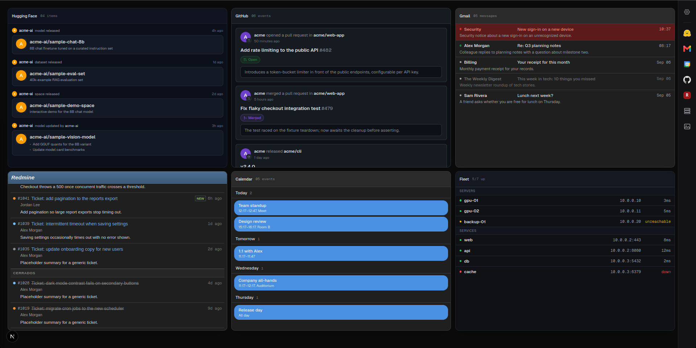

# superfeed

A self-hosted, modular dashboard that pulls your scattered feeds into one draggable grid.
Each panel is a **module** — Hugging Face, Gmail, Calendar, GitHub, Redmine, a fleet board, or a plain image — and every module is a self-contained plugin you register in one line.



> Built-in demo board. Run `DEMO_MODE=1 npx next dev` to explore it with placeholder data and no accounts.

## Quick start

```bash
./scripts/run.sh          # dev on :3000
docker compose up -d --build   # or Docker
```

Open [localhost:3000](http://localhost:3000), click the gear, and fill in **Settings** for the modules you want. All config is stored server-side (SQLite under `.local/`), never committed.

## Adding a module

A module is a React panel plus an optional server route, wired in through a single descriptor.
See **[docs/MODULES.md](./docs/MODULES.md)**.

## Built with

Next.js, React, Tailwind, `react-grid-layout`, `better-sqlite3`, `@phosphor-icons/react`.

## License

[MIT](./LICENSE).
